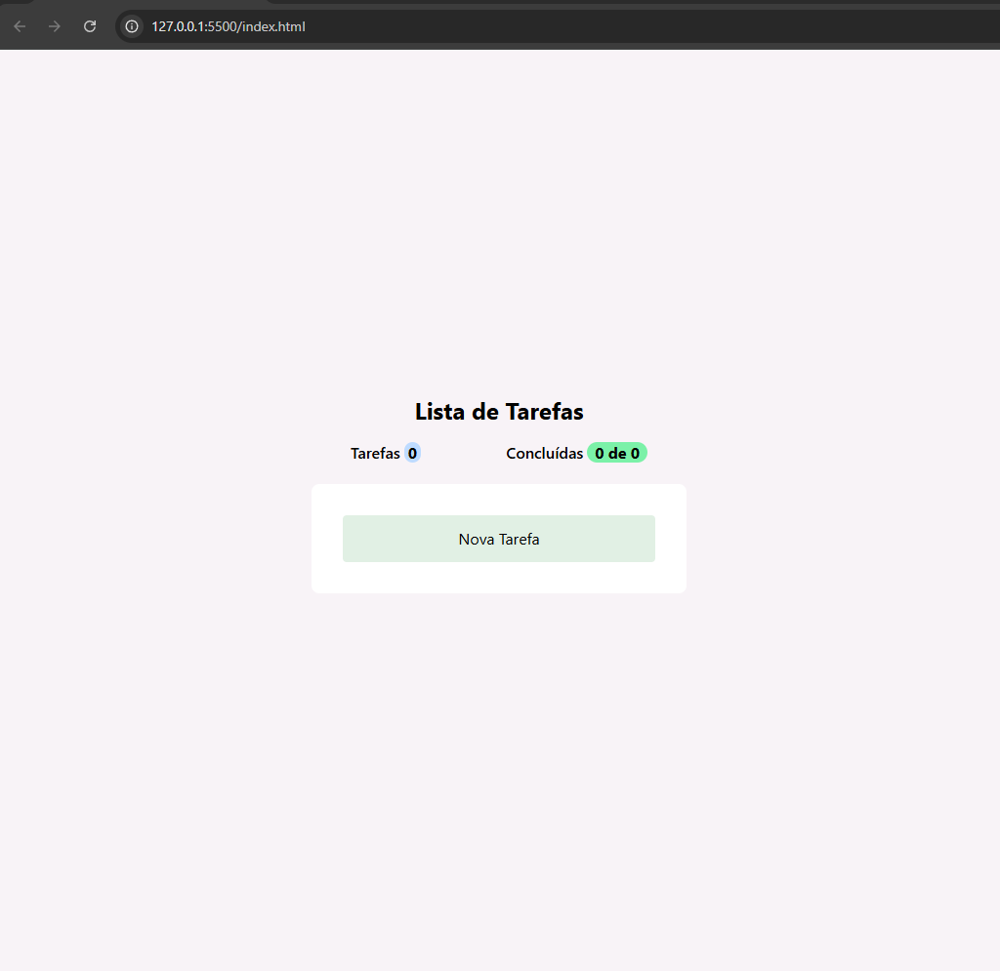
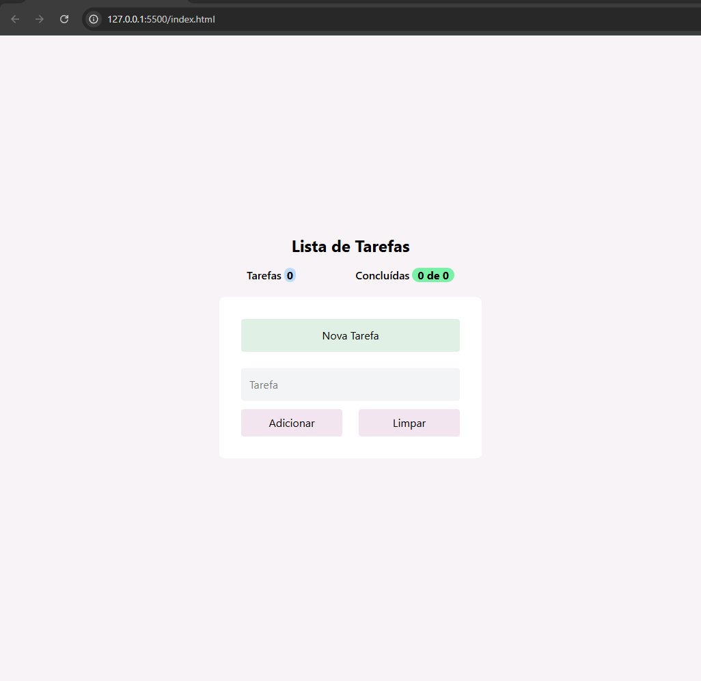
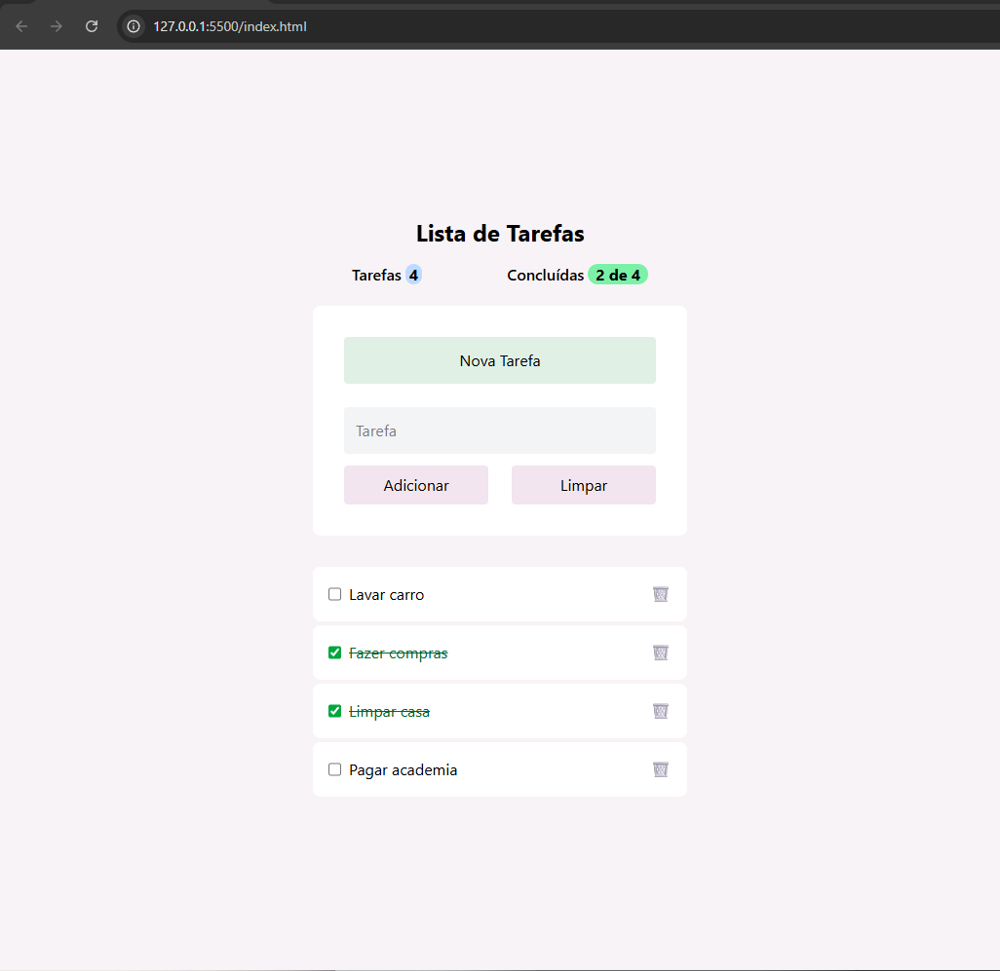

# 📝 Lista de Tarefas - React

Projeto de **lista de tarefas** desenvolvido com **React** e **Tailwind CSS**, com foco em prática de estado, Context API e componentização.

## 🔗 Demo
Abra o arquivo `index.html` diretamente no navegador.

## 📸 Screenshots

### Tela inicial

### Adicionando tarefa

### Lista de tarefas

## ⚙️ Tecnologias utilizadas
- React 18 (via CDN)
- Tailwind CSS
- JavaScript (ES6+)
- Context API

## ✅ Funcionalidades
- Adicionar tarefas
- Marcar tarefas como concluídas
- Remover tarefas
- Contador de tarefas totais e concluídas
- Layout responsivo

## 🎯 Objetivo
Projeto desenvolvido para **estudo e prática de React**, aplicando conceitos de:
- Estado global com Context API
- Componentização
- Estilização com Tailwind
- Lógica de listas e eventos

## 👨‍💻 Autor
Matheus Carvalho
